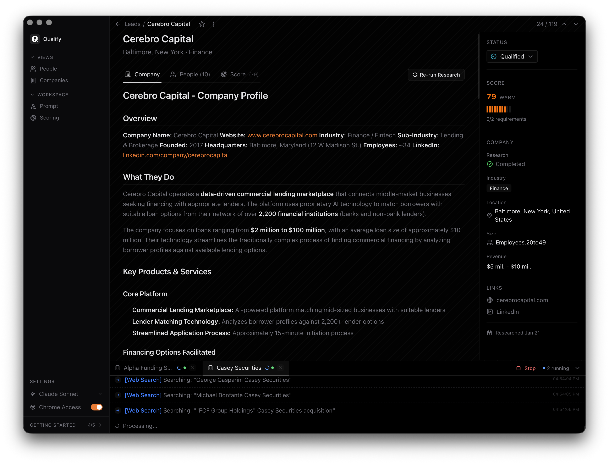
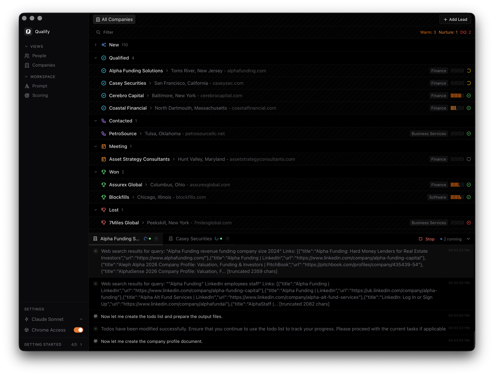
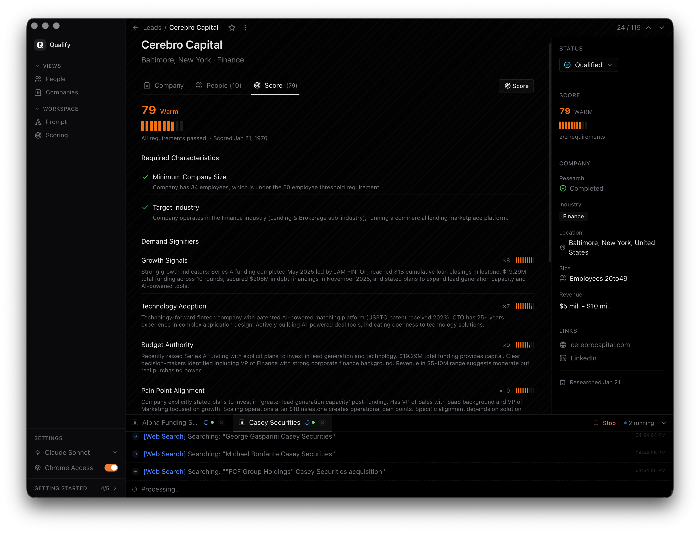

<div align="center">

[](https://github.com/sidehero/claude-sales-expert)
[](LICENSE)
[](https://rustup.rs)
[](https://react.dev)
[](https://tauri.app)

</div>

# Claude Sales Expert

AI-powered B2B lead research and qualification desktop application that leverages Claude Code to automatically research companies, score leads, and help you focus on the opportunities that matter most.

## ⚡ Quick Start (One-Click Install)

> ⚠️ **Required:** Claude Code must be installed first. Download from [claude.ai/code](https://claude.ai/code) and authenticate.

### 🪟 Windows

**Copy-paste this in PowerShell:**
```powershell
irm https://raw.githubusercontent.com/sidehero/claude-sales-expert/master/install.bat -o install.bat; .\install.bat
```

Or use PowerShell:
```powershell
irm https://raw.githubusercontent.com/sidehero/claude-sales-expert/master/install.ps1 -o install.ps1; .\install.ps1
```

### 🍎 macOS

```bash
curl -fsSL https://raw.githubusercontent.com/sidehero/claude-sales-expert/master/install.sh -o install.sh
chmod +x install.sh
./install.sh
```

### 📋 What the Scripts Do
| Step | Action |
|------|--------|
| 1 | Install Bun (if missing) |
| 2 | Install Rust (if missing) |
| 3 | Install WebKit dependencies (macOS only) |
| 4 | Clone the repository |
| 5 | Install npm dependencies |
| 6 | Launch the app |

---

## Table of Contents

- [Overview](#overview)
- [Features](#features)
- [Tech Stack](#tech-stack)
- [Architecture](#architecture)
- [Getting Started](#getting-started)
- [How It Works](#how-it-works)
- [Database Schema](#database-schema)
- [Job System](#job-system)
- [Contributing](#contributing)
- [License](#license)

---

## Overview

Claude Sales Expert is a powerful desktop application for B2B sales teams to research and qualify leads. It automates the tedious research process by using AI to:

- 🔍 **Deep Company Research** - Automatically gather company information, business model, products, employees, funding, and more
- 📊 **AI-Powered Scoring** - Score leads against custom criteria (industry, company size, growth signals, urgency)
- 👥 **Contact Discovery** - Find relevant people at each company with their roles and contact details
- 💬 **Conversation Generation** - Generate personalized conversation topics for each contact
- 📈 **Real-Time Streaming** - Watch research happen live as Claude investigates each lead

---

## Screenshots

### Overview


### Companies


### Rating


---

## Features

### Lead Management
- Add companies manually or import from CSV
- ICP-based lead finder - describe your ideal customer and let AI find matching companies
- Kanban-style lead organization (New, Contacted, Qualified, Negotiation, Closed)
- Bulk actions - research, score, or delete multiple leads at once
- Export leads to CSV

### AI-Powered Research
- Company research with Claude Code
- Person research for individual contacts
- Automatic contact discovery during company research
- Web search integration for finding company information

### Lead Scoring
- Configurable scoring criteria with weighted factors
- Required characteristics (pass/fail gates)
- Demand signifiers (scored factors with weights)
- Tier assignment: Hot (80+), Warm (50-79), Nurture (30-49), Disqualified (<30)
- Detailed score breakdown with reasoning

### Contact Management
- Add contacts manually or discover automatically
- Management level tracking (C-Level, VP, Director, Manager, IC)
- Individual person research
- Conversation topic generation for personalized outreach

### Real-Time Monitoring
- Live streaming of AI research output
- Job queue with concurrent processing (max 5 jobs)
- Job status tracking and recovery
- Stream panel with job logs

---

## Tech Stack

| Layer | Technology |
|-------|------------|
| **Frontend** | React 19, TypeScript, Vite, Tailwind CSS 4 |
| **Desktop** | Tauri 2 |
| **Backend** | Rust |
| **Database** | SQLite (rusqlite with WAL mode) |
| **State** | Zustand with Immer, TanStack Query |
| **UI Components** | Radix UI, Tabler Icons, Sonner toasts |
| **Animations** | Motion (Framer Motion) |
| **AI Backend** | Claude Code |

---

## Architecture

### System Overview

```
┌─────────────────────────────────────────────────────────────────────────────┐
│                           USER INTERFACE                                   │
│  ┌─────────────┐  ┌─────────────┐  ┌─────────────┐  ┌─────────────────┐  │
│  │ Lead List   │  │ Lead Detail │  │ People      │  │ Stream Panel    │  │
│  │ (Kanban)    │  │ (Research)  │  │ (Contacts)  │  │ (Job Output)    │  │
│  └─────────────┘  └─────────────┘  └─────────────┘  └─────────────────┘  │
└─────────────────────────────────────────────────────────────────────────────┘
                                    │
                          Tauri invoke() / Channels
                                    │
┌─────────────────────────────────────────────────────────────────────────────┐
│                           BACKEND (Rust/Tauri)                              │
│                                                                            │
│  ┌─────────────────────────────────────────────────────────────────────┐   │
│  │                    COMMAND HANDLERS                                 │   │
│  │  ┌──────────────┐  ┌──────────────┐  ┌──────────────────────────┐  │   │
│  │  │ database.rs │  │ research.rs  │  │ jobs.rs                  │  │   │
│  │  │ (CRUD)      │  │ (AI jobs)   │  │ (Job management)        │  │   │
│  │  └──────────────┘  └──────────────┘  └──────────────────────────┘  │   │
│  └─────────────────────────────────────────────────────────────────────┘   │
│                                    │                                        │
│         ┌──────────────────────────┼──────────────────────────┐           │
│         ▼                          ▼                          ▼           │
│  ┌─────────────┐          ┌─────────────────┐          ┌─────────────┐    │
│  │  DATABASE  │          │    JOB QUEUE    │          │   EVENTS    │    │
│  │  (SQLite)  │          │  (Async/Tokio)  │          │  (Emitter)  │    │
│  └─────────────┘          └─────────────────┘          └─────────────┘    │
│                                    │                                        │
│                                    ▼                                        │
│                         ┌─────────────────────┐                            │
│                         │   Claude Code         │                            │
│                         │   (AI Backend)       │                            │
│                         └─────────────────────┘                            │
└─────────────────────────────────────────────────────────────────────────────┘
```

### Frontend-Backend Communication

The app uses three communication patterns:

1. **Tauri invoke()** - Request/Response for CRUD operations
2. **Channels** - Streaming events for real-time job output
3. **Tauri Events** - Reactive updates for cache invalidation

---

## Getting Started

### Prerequisites

> ⚠️ **Required:** Claude Code must be installed and authenticated before running the app. Download from [claude.ai/code](https://claude.ai/code).

- [Bun](https://bun.sh) - JavaScript runtime
- [Rust](https://rustup.rs) - Programming language
- [Claude Code](https://claude.ai/code) - AI assistant (required)

### Installation

```bash
# Clone the repository
git clone https://github.com/sidehero/claude-sales-expert.git
cd claude-sales-expert

# Install dependencies
bun install

# Run in development mode
bun run tauri:dev
```

### Build for Production

```bash
bun run tauri:build
```

The executable will be in: `src-tauri/target/release/Claude Sales Expert.exe`

---

## How It Works

### 1. Adding Leads

Leads can be added in two ways:

**Manual Addition:**
```typescript
// Frontend calls insertLead
await insertLead({
  company_name: "Acme Corp",
  website: "https://acme.com",
  city: "San Francisco",
  state: "CA",
  country: "USA"
});
```

**ICP-Based Lead Finder:**
Describe your ideal customer profile, and Claude will search the web to find matching companies.

### 2. Research Workflow

When you click "Research" on a lead:

1. **Prompt Assembly** - System fetches prompt templates from database and injects company data
2. **Claude Code Execution** - Spawns Claude Code with prompt and output file paths
3. **Stream Processing** - Parses Claude's JSON output in real-time
4. **Result Parsing** - CompletionHandler verifies output files and parses content
5. **Database Update** - Stores results (company profile, people, enrichment data)
6. **Event Emission** - Frontend receives updates via Tauri events

### 3. Lead Scoring

1. Configure scoring criteria in Settings:
   - **Required Characteristics**: Pass/fail gates (e.g., "Must be in SaaS industry")
   - **Demand Signifiers**: Weighted factors (e.g., "Recent funding" weight: 5)
   - **Tier Thresholds**: Hot (80+), Warm (50-79), Nurture (30-49)

2. Run scoring on a lead:
   - Claude evaluates the lead against all criteria
   - Outputs structured JSON with scores and reasoning
   - Results stored in database with tier assignment

### 4. Contact Discovery

Two methods:

1. **Automatic**: During company research, Claude outputs a `people.json` with discovered contacts
2. **Manual**: Add contacts directly or research individual people

---

## Database Schema

### Core Tables

| Table | Purpose | Key Fields |
|-------|---------|------------|
| `leads` | Companies | company_name, website, industry, employees, revenue, research_status, company_profile |
| `people` | Contacts | lead_id, first_name, last_name, email, title, management_level, linkedin_url, person_profile |
| `prompts` | Prompt templates | type (company, person, conversation_topics), content |
| `scoring_config` | Scoring rules | required_characteristics (JSON), demand_signifiers (JSON), tier thresholds |
| `lead_scores` | Score results | lead_id, config_id, passes_requirements, total_score, tier, score_breakdown |
| `jobs` | Job tracking | id, job_type, entity_id, status, prompt, output_path, pid, completion_state |
| `job_logs` | Stream logs | job_id, log_type, content, tool_name, timestamp, sequence |
| `settings` | App settings | model (Claude model), use_chrome |

### Data Location

- **Windows**: `%APPDATA%\claude-sales-expert\data.db`
- **macOS**: `~/Library/Application Support/claude-sales-expert/data.db`
- **Linux**: `~/.local/share/claude-sales-expert/data.db`

---

## Job System

### Architecture

```
┌────────────────────────────────────────────────────────────────────┐
│                      JobQueue Structure                            │
├────────────────────────────────────────────────────────────────────┤
│  semaphore: Arc<Semaphore>     // Max 5 concurrent jobs           │
│  active_jobs: Arc<Mutex<HashMap<String, ActiveJob>>>             │
└────────────────────────────────────────────────────────────────────┘
```

### Job Types

| Job Type | Purpose | Output Files |
|----------|---------|--------------|
| `CompanyResearch` | Research a company | company_profile.md, people.json, enrichment.json |
| `PersonResearch` | Research a person | person_profile.md, enrichment.json |
| `Scoring` | Score a lead | score_{id}.json |
| `Conversation` | Generate conversation topics | conversation_{id}.md |
| `LeadFinder` | Find leads matching ICP | leads_{timestamp}.json |

### Job Lifecycle

1. **Queued** - Job registered in memory + persisted to DB
2. **Running** - Semaphore acquired, Claude Code spawned
3. **Streaming** - Output processed in real-time, logs persisted
4. **Completed/Failed** - CompletionHandler verifies, parses, updates DB

### Concurrency & Reliability

- **Max Concurrent Jobs**: 5 (semaphore-based)
- **Timeout**: 10 minutes per job
- **Queue Timeout**: 30 seconds to acquire slot
- **Graceful Shutdown**: SIGTERM → SIGKILL
- **Recovery**: On startup, resets stuck entities to pending

---

## Key Files Reference

| Purpose | Path |
|---------|------|
| Backend entry | `src-tauri/src/lib.rs` |
| Research commands | `src-tauri/src/commands/research.rs` |
| Database schema | `src-tauri/src/db/schema.rs` |
| Job queue | `src-tauri/src/jobs/queue.rs` |
| Completion handler | `src-tauri/src/jobs/completion_handler.rs` |
| Event emission | `src-tauri/src/events.rs` |
| Frontend commands | `src/lib/tauri/commands.ts` |
| Event bridge | `src/lib/tauri/event-bridge.ts` |
| Default prompts | `src-tauri/src/prompts/defaults/*.md` |
| Lead store | `src/lib/store/leads-store.ts` |
| Settings store | `src/lib/store/settings-store.ts` |

---

## Contributing

1. Fork the repository
2. Create a feature branch (`git checkout -b feature/amazing-feature`)
3. Commit your changes (`git commit -m 'Add amazing feature'`)
4. Push to the branch (`git push origin feature/amazing-feature`)
5. Open a Pull Request

---

## License

MIT License - see [LICENSE](LICENSE) for details.

---

<div align="center">

**Built with ❤️ using Tauri, React, and Claude Code**

</div>